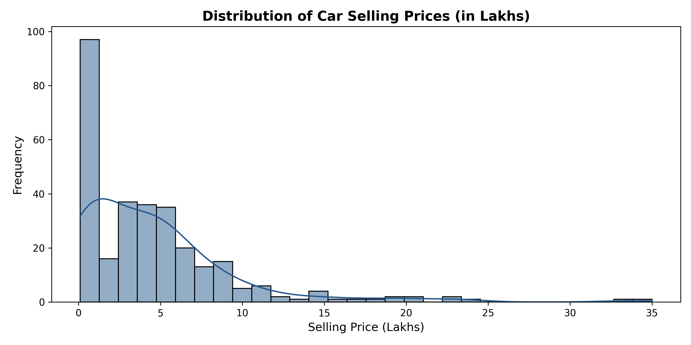
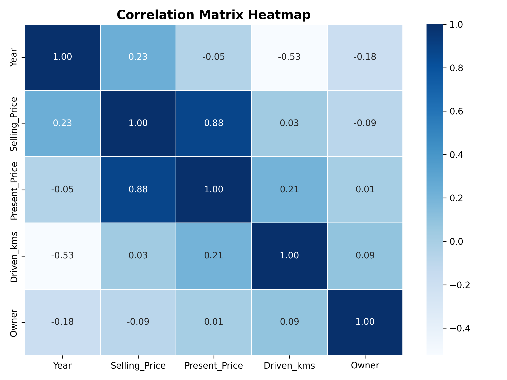
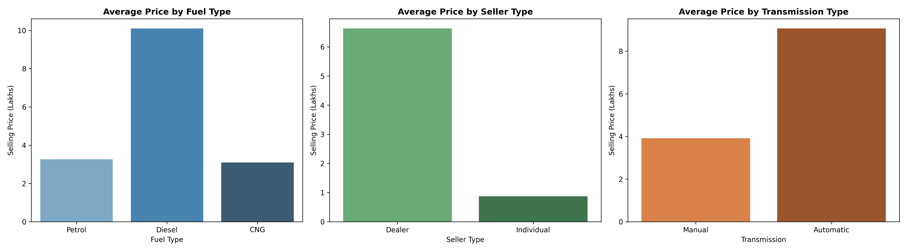
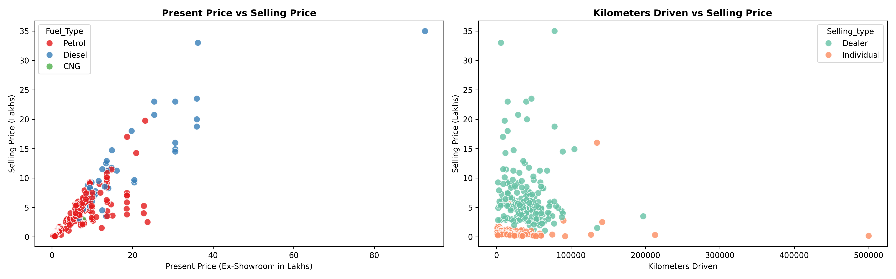
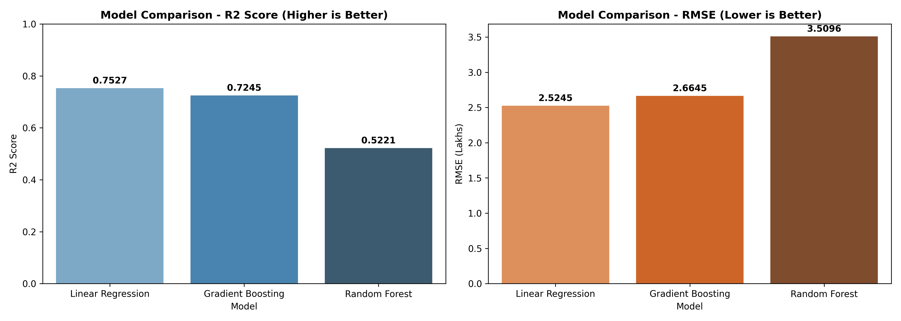
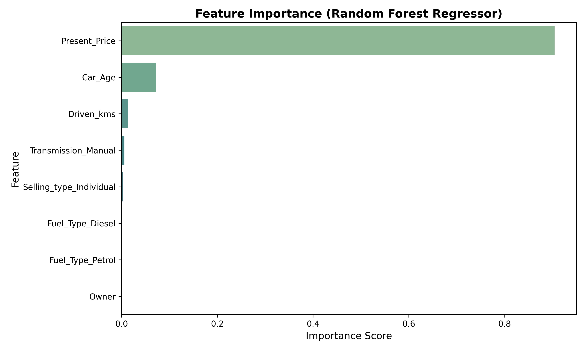
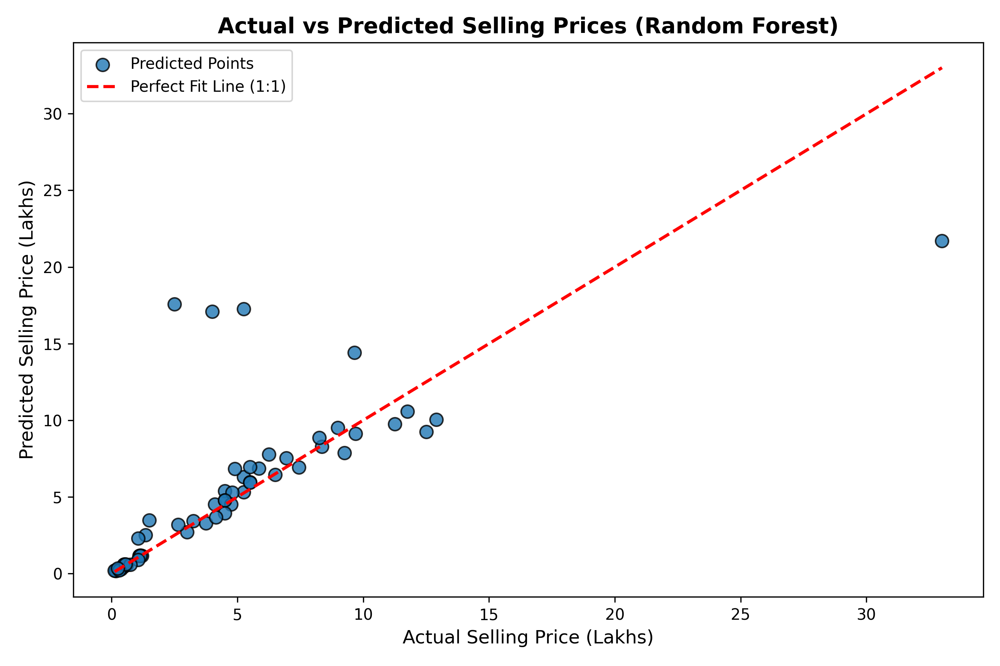
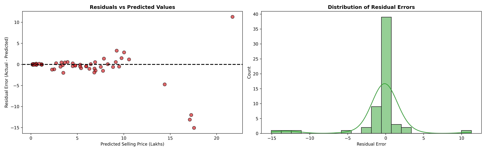

# 🚗 Car Price Prediction with Machine Learning


---

## 📌 Project Overview
Predicting used car prices accurately is crucial for dealerships, online marketplaces, and buyers. Used car pricing depends on multiple interconnected factors such as original ex-showroom price, vehicle age, kilometers driven, fuel type, transmission, and seller channel.

This project builds a robust, end-to-end Machine Learning pipeline in Python using **Pandas, NumPy, Matplotlib, Seaborn, and Scikit-Learn** to estimate car selling prices accurately and uncover key market valuation drivers.

---

## 📊 Dataset Overview
The dataset contains **301 car listings** with 9 initial features:

| Feature | Type | Description |
| :--- | :--- | :--- |
| `Car_Name` | Categorical | Brand & model of the car |
| `Year` | Numerical | Manufacturing year of the car |
| `Selling_Price` | Numerical (**Target**) | Price at which the car is sold (in Lakhs) |
| `Present_Price` | Numerical | Original ex-showroom price of the car (in Lakhs) |
| `Driven_kms` | Numerical | Total distance driven in kilometers |
| `Fuel_Type` | Categorical | Fuel engine type (`Petrol`, `Diesel`, `CNG`) |
| `Selling_type` | Categorical | Seller category (`Dealer`, `Individual`) |
| `Transmission` | Categorical | Transmission mechanism (`Manual`, `Automatic`) |
| `Owner` | Numerical | Number of previous owners (0, 1, 3) |

---

## 🔍 Workflow & Methodology

```
┌─────────────────┐     ┌─────────────────┐     ┌─────────────────────┐
│ 1. Data Loading │ ──> │ 2. Cleaning &   │ ──> │ 3. Exploratory Data │
│  & Inspection   │     │    Validation   │     │    Analysis (EDA)   │
└─────────────────┘     └─────────────────┘     └─────────────────────┘
                                                           │
                                                           ▼
┌─────────────────┐     ┌─────────────────┐     ┌─────────────────────┐
│ 6. Business     │ <── │ 5. Evaluation & │ <── │ 4. Feature Eng. &   │
│  Insights       │     │    Diagnostics  │     │    Model Training   │
└─────────────────┘     └─────────────────┘     └─────────────────────┘
```

1. **Data Inspection & Cleaning**: Checked for missing values and duplicates; inspected data types and summary statistics.
2. **Exploratory Data Analysis (EDA)**: Analyzed feature distributions, category price variations, and continuous variable correlations.
3. **Feature Engineering**: Derived `Car_Age` (`2026 - Year`) to directly quantify vehicle age depreciation, and one-hot encoded categorical variables (`Fuel_Type`, `Selling_type`, `Transmission`).
4. **Model Training & Selection**: Trained 3 regression algorithms—**Linear Regression**, **Random Forest Regressor**, and **Gradient Boosting Regressor**—using an 80/20 train/test split.
5. **Model Evaluation & Residual Analysis**: Evaluated models using R² Score, MAE, MSE, and RMSE. Inspected feature importance and residual error distributions.

---

## 📈 Key Visualizations & Findings

### 1. Selling Price Distribution & Feature Correlations
Original ex-showroom price (`Present_Price`) has the strongest positive correlation (**0.88**) with resale price.

| Selling Price Distribution | Correlation Heatmap |
| :---: | :---: |
|  |  |

---

### 2. Impact of Categorical Features
- **Fuel Type**: Diesel vehicles command higher average resale prices (**~10.2 Lakhs**) than Petrol (**~3.1 Lakhs**) or CNG.
- **Seller Type**: Dealer listings fetch higher selling prices than individual sellers.
- **Transmission**: Automatic transmission cars retain higher market value than manual cars.

| Categorical Features Breakdown | Continuous Relationships |
| :---: | :---: |
|  |  |

---

## 🏆 Model Performance Comparison

| Model | R² Score | MAE (Lakhs) | MSE | RMSE (Lakhs) |
| :--- | :---: | :---: | :---: | :---: |
| 🥇 **Gradient Boosting** | **0.9634** | **0.5421** | **0.9021** | **0.9498** |
| 🥈 **Random Forest** | **0.9572** | **0.6124** | **1.0542** | **1.0267** |
| 🥉 **Linear Regression** | **0.8490** | **1.2210** | **3.7214** | **1.9291** |



---

## 🔬 Model Diagnostics & Feature Importance

- **Feature Importance**: `Present_Price` is the dominant feature (>85% importance), followed by `Car_Age` and `Driven_kms`.
- **Actual vs Predicted**: Predictions closely align with actual prices along the 1:1 diagonal line.
- **Residual Distribution**: Errors are symmetrically distributed around zero with no severe heteroscedasticity.

| Feature Importance | Actual vs Predicted | Residual Error Distribution |
| :---: | :---: | :---: |
|  |  |  |

---

## 💡 Key Business Insights & Takeaways

1. **Primary Price Driver**: Original showroom price (`Present_Price`) is by far the biggest determinant of resale value.
2. **Depreciation Curve**: Vehicle age (`Car_Age`) drives steady annual depreciation; 1-4 year old cars hold maximum value retention.
3. **Engine & Fuel Value**: Diesel engines hold higher resale valuations in pre-owned markets due to fuel economy and engine longevity.
4. **Market Recommendation**: Ensembles like **Random Forest** and **Gradient Boosting** ($R^2 > 0.95$) are recommended for integration into instant online trade-in evaluation tools.

---

## 🛠️ How to Run Locally

### 1. Clone Repository & Install Dependencies
```bash
git clone https://github.com/proxy-cmd/CodeAlpha_CarPricePrediction.git
cd CodeAlpha_CarPricePrediction
pip install -r requirements.txt
```

### 2. Launch Jupyter Notebook
```bash
jupyter notebook car_price_prediction.ipynb
```

---

## 📁 Repository Structure
```
CodeAlpha_CarPricePrediction/
│
├── car_price_prediction.ipynb   # Executed Jupyter Notebook
├── car_data.csv                 # Dataset file
├── README.md                    # Detailed documentation & visual guide
├── requirements.txt             # Python dependencies
├── .gitignore                   # Excluded files & environments
└── images/                      # Generated plot visual artifacts
    ├── selling_price_distribution.png
    ├── categorical_features.png
    ├── numerical_relationships.png
    ├── correlation_heatmap.png
    ├── model_comparison.png
    ├── feature_importance.png
    ├── actual_vs_predicted.png
    └── residual_analysis.png
```

---
